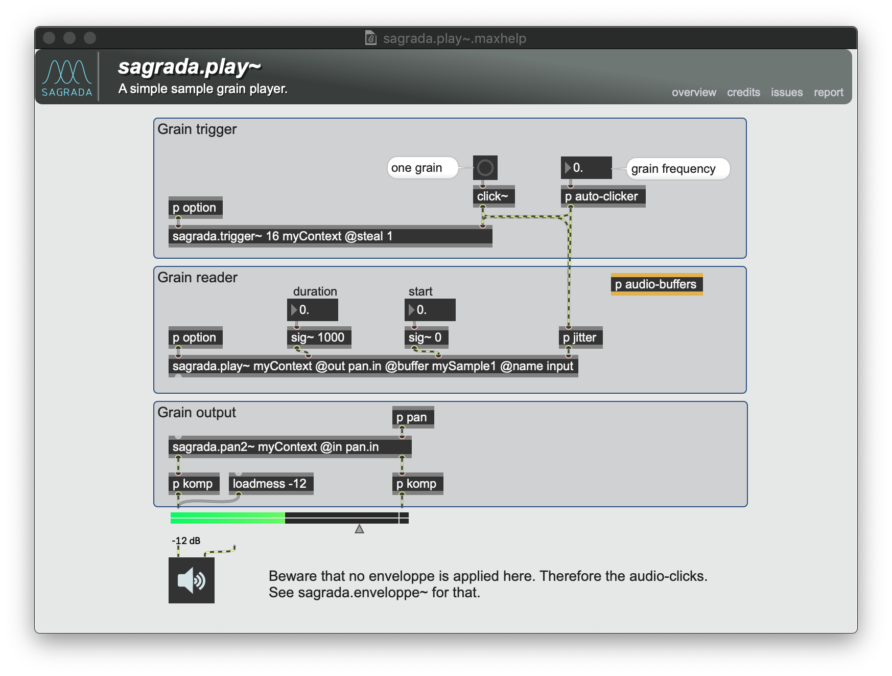

 

# About Sagrada

## What??

Sagrada is a draft Max package performing sample-accurate granular synthesis in a modular way. Grains can be triggered both synchronously and asynchronously. Each grain can have its own effects and eveloppes (for instance the first "attack" and last "release" grains of a grains stream).

## Installation

Put this folder in your Max package folder.
Use help files.

## Screnshot

## Warning

This library is experimental and under construction. 
Breaking changes are more than likely to occur.
Use at your own risks! ;)

Meanwhile, any feedback is welcome : do pull-request and email me!
