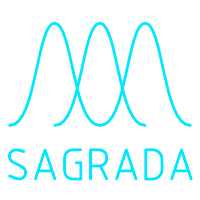

 

# About Sagrada

## What??

Sagrada is a draft Max package performing sample-accurate granular synthesis in a modular way.

## Installation

Put this folder in your Max package folder.
Use help files.

## Warning

This library is experimental and under construction. 
Breaking changes are more than likely to occur.
Use at your own risks! ;)

Meanwhile, any feedback is welcome : do pull-request and email me!
